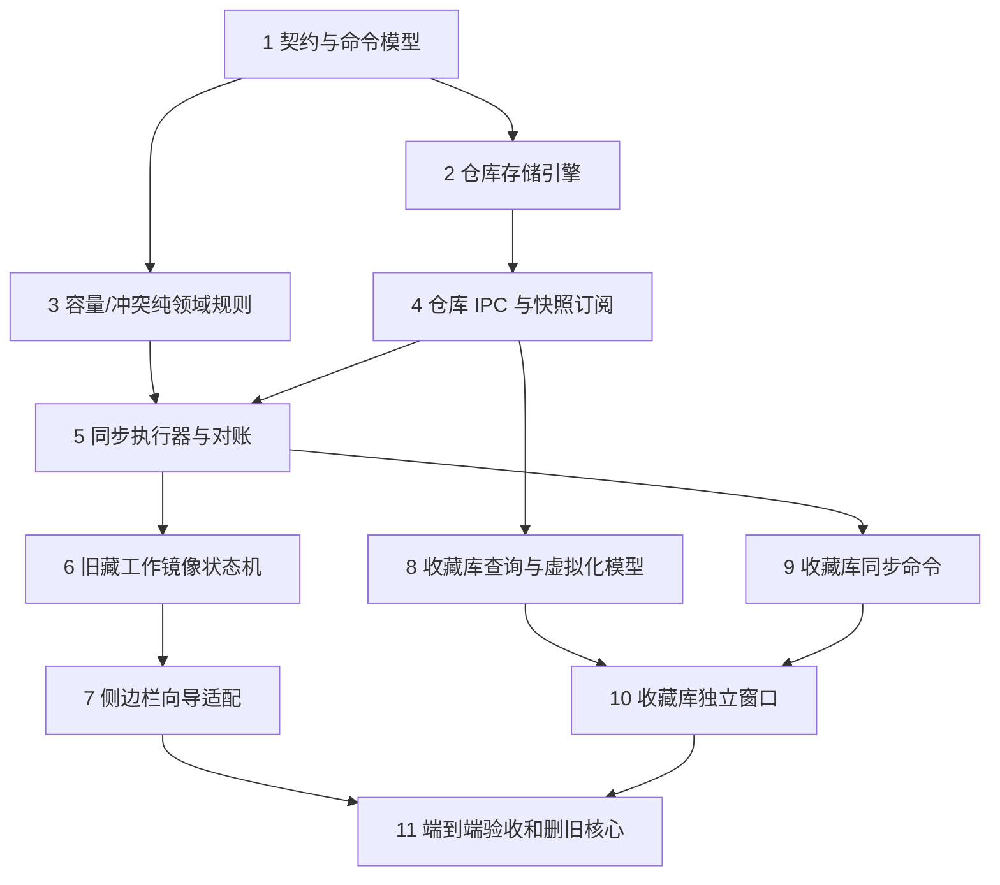

# 整理旧藏核心重做与收藏仓库 Implementation Plan

> **For agentic workers:** REQUIRED SUB-SKILL: Use superpowers:subagent-driven-development (recommended) or superpowers:executing-plans to implement this plan task-by-task. Steps use checkbox (`- [ ]`) syntax for tracking.

**Goal:** 以 Electron 账号收藏仓库和稳定工作镜像替换旧藏的分散状态，使 B 站同步主路径可恢复、可对账，并交付独立窗口的完整收藏库。

**Architecture:** 主进程 `AccountFavoriteRepository` 保存每账号的规范化视频、成员索引、工作镜像和同步对账记录；主/收藏库渲染器只请求分页快照和命令。先纵切同步主路径，再由同一仓库提供收藏库窗口；旧核心只在所有替代测试和三形态验收通过后删除。

**Tech Stack:** Electron 42、TypeScript、React 19、Vite、Vitest、现有 B 站页面脚本桥接。

---

## 执行规则与并行图

每个任务在独立 worktree 和 `codex/` 分支中执行；完成一个需求整改即运行规定测试、提交一次完整 commit。任务合并顺序是依赖约束，不等于只能串行研究。



可并行工作包：任务 2 与任务 3 在任务 1 合并后可并行；任务 6 的纯状态机测试可在任务 5 稳定接口后与任务 8 并行；任务 9 与任务 7 可并行。禁止两个会话同时修改 `electron/main/index.ts`、`electron/preload/index.ts`、`src/renderer/src/global.d.ts` 或 `FavoriteLedgerPanel.tsx`；这些文件由相应集成任务串行修改。

### Task 1: 定义统一仓库契约（串行门槛）

**Files:**
- Create: `src/shared/favoriteRepository.ts`
- Create: `src/shared/favoriteRepository.test.ts`
- Modify: `src/shared/types.ts`

- [ ] **Step 1: 写出失败的领域契约测试**

```ts
import { createAccountRepositorySnapshot, applyRepositoryCommand } from './favoriteRepository'

it('rejects a command whose account differs from the snapshot account', () => {
  const snapshot = createAccountRepositorySnapshot({ accountMid: '100', now: '2026-07-19T00:00:00.000Z' })
  expect(() => applyRepositoryCommand(snapshot, {
    id: 'command-1', accountMid: '200', type: 'commit-local-plan', payload: {}
  })).toThrow('Favorite repository account mismatch.')
})
```

- [ ] **Step 2: 运行失败测试并确认原因是模块不存在**

Run: `npm test -- src/shared/favoriteRepository.test.ts`

Expected: FAIL，提示无法解析 `./favoriteRepository`。

- [ ] **Step 3: 实现最小共享类型与账号校验**

```ts
export type FavoriteRepositoryCommand = {
  id: string
  accountMid: string
  type: 'commit-local-plan'
  payload: Record<string, never>
}

export function createAccountRepositorySnapshot(input: { accountMid: string; now: string }) {
  return { version: 1 as const, accountMid: input.accountMid, revision: 0, updatedAt: input.now }
}

export function applyRepositoryCommand<T extends { accountMid: string }>(snapshot: T, command: FavoriteRepositoryCommand) {
  if (snapshot.accountMid !== command.accountMid) throw new Error('Favorite repository account mismatch.')
  return snapshot
}
```

将完整契约扩展为视频、收藏夹、成员索引、逻辑分卷、工作镜像、命令结果、同步状态和分页快照的可判别联合类型；禁止 `unknown` 作为公共命令载荷。

- [ ] **Step 4: 运行共享契约测试**

Run: `npm test -- src/shared/favoriteRepository.test.ts`

Expected: PASS。

- [ ] **Step 5: 提交门槛契约**

```bash
git add src/shared/favoriteRepository.ts src/shared/favoriteRepository.test.ts src/shared/types.ts
git commit -m "feat: define favorite repository contracts"
```

### Task 2: 实现账号仓库原子持久化（可与 Task 3 并行）

**Files:**
- Create: `electron/main/favoriteRepositoryService.ts`
- Create: `electron/main/favoriteRepositoryService.test.ts`
- Modify: `electron/main/oldFavoriteWorkspaceService.ts`
- Modify: `electron/main/oldFavoriteWorkspaceService.test.ts`

- [ ] **Step 1: 写出跨账号隔离、原子恢复和成员索引的失败测试**

```ts
it('loads only the requested account and stores folder membership as aid indexes', async () => {
  const service = new FavoriteRepositoryService({ root: temporaryDirectory })
  await service.commit('100', { id: 'c1', accountMid: '100', type: 'upsert-video', payload: { aid: 1, title: 'A' } })
  await service.commit('100', { id: 'c2', accountMid: '100', type: 'set-folder-members', payload: { folderId: 'local:inbox', aids: [1] } })
  expect((await service.getFolderPage('100', 'local:inbox', { limit: 10 })).items.map((item) => item.aid)).toEqual([1])
  await expect(service.getSnapshot('200')).resolves.toMatchObject({ accountMid: '200', videos: 0 })
})
```

- [ ] **Step 2: 运行失败测试**

Run: `npm test -- electron/main/favoriteRepositoryService.test.ts`

Expected: FAIL，提示 `FavoriteRepositoryService` 不存在。

- [ ] **Step 3: 实现每账号仓库目录和写入队列**

实现 `accounts/<mid>/repository.json` 元数据、按批 JSONL 的视频/成员记录、临时文件 rename 原子提交、校验和恢复。以 `aid` 为主键保存视频，收藏夹只写 `aid` 集合；同一 `command.id` 重放返回原结果，绝不重复修改成员。

将 `OldFavoriteWorkspaceService` 标记为仅供旧核心删除前的兼容读取，不得让新服务依赖它或写入其目录。

- [ ] **Step 4: 运行持久化与旧工作区回归测试**

Run: `npm test -- electron/main/favoriteRepositoryService.test.ts electron/main/oldFavoriteWorkspaceService.test.ts`

Expected: PASS。

- [ ] **Step 5: 提交仓库存储引擎**

```bash
git add electron/main/favoriteRepositoryService.ts electron/main/favoriteRepositoryService.test.ts electron/main/oldFavoriteWorkspaceService.ts electron/main/oldFavoriteWorkspaceService.test.ts
git commit -m "feat: persist account favorite repository"
```

### Task 3: 提取容量、分卷与分类冲突纯规则（可与 Task 2 并行）

**Files:**
- Create: `src/shared/favoriteRepositoryPlanning.ts`
- Create: `src/shared/favoriteRepositoryPlanning.test.ts`
- Modify: `src/renderer/src/features/favorites/favoritePhysicalShards.ts`
- Modify: `src/renderer/src/features/favorites/favoritePhysicalShards.test.ts`

- [ ] **Step 1: 写出 99、1,000、50,000 和冲突优先级的失败测试**

```ts
it('routes a low-confidence automatic proposal to unclassified instead of a second target', () => {
  expect(resolveRepositoryTargets({
    candidates: [{ ledgerId: 'game', source: 'system-low' }, { ledgerId: 'knowledge', source: 'system-low' }],
    maximumTargets: 3
  })).toEqual({ targetLedgerIds: [], reason: 'insufficient-reliable-targets' })
})

it('blocks a remote plan that would exceed the Bilibili folder limit', () => {
  expect(planRemoteCapacity({ currentFolderCount: 99, shardCreates: 1, inboxTotal: 0 })).toMatchObject({ allowed: false })
})
```

- [ ] **Step 2: 运行失败测试**

Run: `npm test -- src/shared/favoriteRepositoryPlanning.test.ts`

Expected: FAIL，提示规划模块不存在。

- [ ] **Step 3: 实现唯一的远程预检规则**

实现 `resolveRepositoryTargets` 与 `planRemoteCapacity`：人工 > DeepSeek > 高置信 > 低置信；仅人工/DeepSeek 可多目标；每分卷 1,000；远程收藏夹总数最多 99；默认收藏超过 50,000 直接禁止执行。将 `favoritePhysicalShards` 改为调用共享逻辑，消除两套分卷规则。

- [ ] **Step 4: 运行规划与分卷测试**

Run: `npm test -- src/shared/favoriteRepositoryPlanning.test.ts src/renderer/src/features/favorites/favoritePhysicalShards.test.ts`

Expected: PASS。

- [ ] **Step 5: 提交纯规则**

```bash
git add src/shared/favoriteRepositoryPlanning.ts src/shared/favoriteRepositoryPlanning.test.ts src/renderer/src/features/favorites/favoritePhysicalShards.ts src/renderer/src/features/favorites/favoritePhysicalShards.test.ts
git commit -m "feat: centralize favorite capacity planning"
```

### Task 4: 暴露仓库 IPC、版本快照与账号切换（依赖 Task 2）

**Files:**
- Create: `electron/main/favoriteRepositoryIpc.ts`
- Create: `electron/main/favoriteRepositoryIpc.test.ts`
- Modify: `electron/main/index.ts`
- Modify: `electron/preload/index.ts`
- Modify: `src/renderer/src/global.d.ts`

- [ ] **Step 1: 写出失败的 IPC 授权和增量订阅测试**

```ts
it('publishes a newer revision only to subscribers of the changed account', async () => {
  const bridge = registerFavoriteRepositoryIpc({ repository, ipcMain, webContents })
  const received: unknown[] = []
  bridge.subscribe({ senderId: 1, accountMid: '100', send: (_channel, value) => received.push(value) })
  await repository.commit('100', command)
  expect(received).toContainEqual(expect.objectContaining({ accountMid: '100', revision: 1 }))
})
```

- [ ] **Step 2: 运行失败测试**

Run: `npm test -- electron/main/favoriteRepositoryIpc.test.ts`

Expected: FAIL，提示 IPC 注册模块不存在。

- [ ] **Step 3: 实现最小 IPC 面**

暴露 `openAccount`、`getSnapshot`、`getFolderPage`、`searchPage`、`commitCommand`、`subscribe` 和 `unsubscribe`。调用方必须显式传 `accountMid`；主进程以当前登录账号校验命令；通知只传 revision、受影响 folder/aids 与当前页失效标记，不能全量广播 30,000 条。

- [ ] **Step 4: 运行 IPC 和类型测试**

Run: `npm test -- electron/main/favoriteRepositoryIpc.test.ts`

Expected: PASS。

- [ ] **Step 5: 提交 IPC 集成**

```bash
git add electron/main/favoriteRepositoryIpc.ts electron/main/favoriteRepositoryIpc.test.ts electron/main/index.ts electron/preload/index.ts src/renderer/src/global.d.ts
git commit -m "feat: expose favorite repository snapshots"
```

### Task 5: 构建同步执行器、幂等检查点与未知结果对账（依赖 Task 3、4）

**Files:**
- Create: `electron/main/favoriteRepositorySyncService.ts`
- Create: `electron/main/favoriteRepositorySyncService.test.ts`
- Modify: `src/renderer/src/features/favorites/favoriteLedgerApi.ts`
- Modify: `src/renderer/src/features/favorites/favoriteLedgerApi.test.ts`
- Modify: `src/renderer/src/features/favorites/favoriteExecutionSafety.ts`
- Modify: `src/renderer/src/features/favorites/favoriteExecutionSafety.test.ts`

- [ ] **Step 1: 写出失败的冻结计划和未知结果对账测试**

```ts
it('never retries an unknown append before reconciliation confirms it is absent', async () => {
  const run = await service.executeFrozenPlan(accountMid, frozenPlan)
  expect(run.status).toBe('result-unknown')
  expect(pageBridge.append).toHaveBeenCalledTimes(1)
  await service.resume(accountMid, run.id)
  expect(pageBridge.append).toHaveBeenCalledTimes(1)
})
```

- [ ] **Step 2: 运行失败测试**

Run: `npm test -- electron/main/favoriteRepositorySyncService.test.ts`

Expected: FAIL，提示同步服务不存在。

- [ ] **Step 3: 实现冻结执行与页面桥接适配器**

把现有 `favoriteLedgerApi` 脚本收敛为受控 B 站页面适配器：读取现有工作夹/分卷、创建必要分卷、追加、移除、成员对账。同步服务写入 `frozenPlan`、操作幂等键、节流、每步检查点和结果状态；计划冻结后禁止再调用分类器改变目标。

- [ ] **Step 4: 运行执行器、页面脚本与安全回归测试**

Run: `npm test -- electron/main/favoriteRepositorySyncService.test.ts src/renderer/src/features/favorites/favoriteLedgerApi.test.ts src/renderer/src/features/favorites/favoriteExecutionSafety.test.ts`

Expected: PASS。

- [ ] **Step 5: 提交同步执行器**

```bash
git add electron/main/favoriteRepositorySyncService.ts electron/main/favoriteRepositorySyncService.test.ts src/renderer/src/features/favorites/favoriteLedgerApi.ts src/renderer/src/features/favorites/favoriteLedgerApi.test.ts src/renderer/src/features/favorites/favoriteExecutionSafety.ts src/renderer/src/features/favorites/favoriteExecutionSafety.test.ts
git commit -m "feat: execute reconciled favorite sync plans"
```

### Task 6: 实现新旧藏工作镜像状态机（依赖 Task 2、5）

**Files:**
- Create: `src/shared/oldFavoriteWorkspace.ts`
- Create: `src/shared/oldFavoriteWorkspace.test.ts`
- Create: `electron/main/oldFavoriteWorkspaceCoordinator.ts`
- Create: `electron/main/oldFavoriteWorkspaceCoordinator.test.ts`
- Modify: `src/shared/oldFavoriteSessions.ts`
- Modify: `src/shared/oldFavoriteSessions.test.ts`

- [ ] **Step 1: 写出失败的不中断完整路径测试**

```ts
it('keeps additions discovered after a frozen 2000-item segment in the continuation area', () => {
  const workspace = createOldFavoriteWorkspace({ accountMid: '100', segmentSize: 2000, aids: Array.from({ length: 2001 }, (_, i) => i + 1) })
  const frozen = freezeWorkspaceSegment(workspace, 'segment-1')
  expect(recordDiscoveredFavorites(frozen, [3001]).continuationAids).toEqual([3001])
})
```

- [ ] **Step 2: 运行失败测试**

Run: `npm test -- src/shared/oldFavoriteWorkspace.test.ts electron/main/oldFavoriteWorkspaceCoordinator.test.ts`

Expected: FAIL，提示新工作镜像模块不存在。

- [ ] **Step 3: 实现基准、差量历史与恢复计划**

实现扫描阶段、来源选择、推荐、预览、确认、执行、对账和完成状态；扫描完成写稳定基准；人工/DeepSeek/再分类的差量命令可多步 undo/redo；DeepSeek 一批为一个历史步骤。默认增量保护成功分类；全量重整显式解除保护；恢复失败丢弃新工作镜像并重建，不读取旧格式批次。

- [ ] **Step 4: 运行状态机和旧会话回归测试**

Run: `npm test -- src/shared/oldFavoriteWorkspace.test.ts electron/main/oldFavoriteWorkspaceCoordinator.test.ts src/shared/oldFavoriteSessions.test.ts`

Expected: PASS。

- [ ] **Step 5: 提交工作镜像状态机**

```bash
git add src/shared/oldFavoriteWorkspace.ts src/shared/oldFavoriteWorkspace.test.ts electron/main/oldFavoriteWorkspaceCoordinator.ts electron/main/oldFavoriteWorkspaceCoordinator.test.ts src/shared/oldFavoriteSessions.ts src/shared/oldFavoriteSessions.test.ts
git commit -m "feat: add durable old favorite workspace"
```

### Task 7: 将稳定侧边栏向导接入新状态机（依赖 Task 6）

**Files:**
- Create: `src/renderer/src/features/assistant/useOldFavoriteWorkspace.ts`
- Create: `src/renderer/src/features/assistant/useOldFavoriteWorkspace.test.tsx`
- Modify: `src/renderer/src/features/assistant/FavoriteLedgerPanel.tsx`
- Modify: `src/renderer/src/features/assistant/FavoriteLedgerPanel.test.tsx`
- Modify: `src/renderer/src/App.tsx`
- Modify: `src/renderer/src/App.test.tsx`

- [ ] **Step 1: 写出失败的“点击即扫描中、切页恢复”的组件测试**

```tsx
it('shows scanning immediately and restores the same preview after the panel remounts', async () => {
  render(<FavoriteLedgerPanel {...props} />)
  fireEvent.click(screen.getByRole('button', { name: '整理旧藏' }))
  expect(await screen.findByText('扫描概览：扫描中')).toBeInTheDocument()
  unmount()
  render(<FavoriteLedgerPanel {...props} />)
  expect(await screen.findByRole('region', { name: '整理旧藏向导' })).toHaveTextContent('归档预览')
})
```

- [ ] **Step 2: 运行失败测试**

Run: `npm test -- src/renderer/src/features/assistant/useOldFavoriteWorkspace.test.tsx src/renderer/src/features/assistant/FavoriteLedgerPanel.test.tsx`

Expected: FAIL，提示 hook 或“扫描概览：扫描中”不存在。

- [ ] **Step 3: 用命令/快照 hook 替换面板权威状态**

保留现有向导布局、说明、预览交互和虚拟列表；删除面板内镜像、恢复补丁与竞态 refs 的权威职责。hook 只订阅当前账号/当前分段快照并调用 repository command。确认页提供“保存并同步到 B站”和“仅保存到收藏库”；同步主路径默认突出显示。

- [ ] **Step 4: 运行面板和 App 回归测试**

Run: `npm test -- src/renderer/src/features/assistant/useOldFavoriteWorkspace.test.tsx src/renderer/src/features/assistant/FavoriteLedgerPanel.test.tsx src/renderer/src/App.test.tsx`

Expected: PASS，且 `FavoriteLedgerPanel` 无新增 `act(...)` 警告。

- [ ] **Step 5: 提交侧边栏适配**

```bash
git add src/renderer/src/features/assistant/useOldFavoriteWorkspace.ts src/renderer/src/features/assistant/useOldFavoriteWorkspace.test.tsx src/renderer/src/features/assistant/FavoriteLedgerPanel.tsx src/renderer/src/features/assistant/FavoriteLedgerPanel.test.tsx src/renderer/src/App.tsx src/renderer/src/App.test.tsx
git commit -m "feat: drive old favorite panel from repository"
```

### Task 8: 实现收藏库查询、搜索与列表虚拟化模型（依赖 Task 4，可与 Task 7 并行）

**Files:**
- Create: `src/renderer/src/features/favorites/favoriteLibraryModel.ts`
- Create: `src/renderer/src/features/favorites/favoriteLibraryModel.test.ts`
- Create: `src/renderer/src/features/favorites/VirtualFavoriteLibraryList.tsx`
- Create: `src/renderer/src/features/favorites/VirtualFavoriteLibraryList.test.tsx`

- [ ] **Step 1: 写出失败的全局 aid 去重和 30,000 条窗口化测试**

```ts
it('returns one search row per aid and includes every folder membership', () => {
  expect(buildLibrarySearchRows([{ aid: 1, folderId: 'a' }, { aid: 1, folderId: 'b' }])).toEqual([
    expect.objectContaining({ aid: 1, folderIds: ['a', 'b'] })
  ])
})

it('renders fewer than 100 list items for a 30000-item page', () => {
  render(<VirtualFavoriteLibraryList items={Array.from({ length: 30000 }, (_, aid) => ({ aid }))} />)
  expect(screen.getAllByRole('listitem').length).toBeLessThan(100)
})
```

- [ ] **Step 2: 运行失败测试**

Run: `npm test -- src/renderer/src/features/favorites/favoriteLibraryModel.test.ts src/renderer/src/features/favorites/VirtualFavoriteLibraryList.test.tsx`

Expected: FAIL，提示收藏库模型和列表不存在。

- [ ] **Step 3: 实现纯查询模型与通用虚拟列表**

实现导航节点、待处理聚合、全局搜索去重、具体收藏夹正常成员显示、详情模型和分页游标；虚拟列表只接收当前页且缩略图 URL 仅在可见项请求。

- [ ] **Step 4: 运行收藏库纯模型测试**

Run: `npm test -- src/renderer/src/features/favorites/favoriteLibraryModel.test.ts src/renderer/src/features/favorites/VirtualFavoriteLibraryList.test.tsx`

Expected: PASS。

- [ ] **Step 5: 提交收藏库查询层**

```bash
git add src/renderer/src/features/favorites/favoriteLibraryModel.ts src/renderer/src/features/favorites/favoriteLibraryModel.test.ts src/renderer/src/features/favorites/VirtualFavoriteLibraryList.tsx src/renderer/src/features/favorites/VirtualFavoriteLibraryList.test.tsx
git commit -m "feat: add virtualized favorite library model"
```

### Task 9: 增加收藏库同步、失败重试和转写转交命令（依赖 Task 5、8）

**Files:**
- Create: `electron/main/favoriteLibraryCommands.ts`
- Create: `electron/main/favoriteLibraryCommands.test.ts`
- Modify: `electron/main/favoriteRepositoryIpc.ts`
- Modify: `electron/main/favoriteRepositoryIpc.test.ts`
- Modify: `electron/main/videoTranscriptionQueue.ts`
- Modify: `electron/main/videoTranscriptionQueue.test.ts`

- [ ] **Step 1: 写出失败的批量同步和转写转交测试**

```ts
it('queues an unknown sync item for reconciliation instead of retrying it', async () => {
  await commands.syncItems('100', [1])
  expect(await repository.getPendingState('100', 1)).toBe('pending-reconcile')
})

it('forwards selected library aids to the existing transcription queue', async () => {
  await commands.enqueueTranscription('100', [1, 2])
  expect(transcriptionQueue.enqueueAids).toHaveBeenCalledWith('100', [1, 2])
})
```

- [ ] **Step 2: 运行失败测试**

Run: `npm test -- electron/main/favoriteLibraryCommands.test.ts electron/main/videoTranscriptionQueue.test.ts`

Expected: FAIL，提示收藏库命令模块不存在。

- [ ] **Step 3: 实现仓库命令适配器**

实现单条、批量、按收藏夹同步；失败记录可继续/重试；未知结果必须先对账。将选中 aid 转交现有转写队列公开命令，不新增第二套队列或下载器。

- [ ] **Step 4: 运行命令及 IPC 回归测试**

Run: `npm test -- electron/main/favoriteLibraryCommands.test.ts electron/main/favoriteRepositoryIpc.test.ts electron/main/videoTranscriptionQueue.test.ts`

Expected: PASS。

- [ ] **Step 5: 提交收藏库命令**

```bash
git add electron/main/favoriteLibraryCommands.ts electron/main/favoriteLibraryCommands.test.ts electron/main/favoriteRepositoryIpc.ts electron/main/favoriteRepositoryIpc.test.ts electron/main/videoTranscriptionQueue.ts electron/main/videoTranscriptionQueue.test.ts
git commit -m "feat: add favorite library sync commands"
```

### Task 10: 创建收藏库独立 Electron 窗口（依赖 Task 8、9）

**Files:**
- Create: `electron/main/favoriteLibraryWindow.ts`
- Create: `electron/main/favoriteLibraryWindow.test.ts`
- Create: `src/renderer/src/features/favorites/FavoriteLibraryApp.tsx`
- Create: `src/renderer/src/features/favorites/FavoriteLibraryApp.test.tsx`
- Create: `src/renderer/src/features/favorites/FavoriteLibraryApp.css`
- Modify: `electron/main/index.ts`
- Modify: `electron/preload/index.ts`
- Modify: `src/renderer/src/global.d.ts`
- Modify: `src/renderer/src/features/assistant/FavoriteLedgerPanel.tsx`

- [ ] **Step 1: 写出失败的窗口复用和三栏交互测试**

```ts
it('reuses the library window and restores its account-scoped view state', () => {
  const first = controller.open({ accountMid: '100' })
  controller.saveViewState('100', { selectedFolderId: 'local:inbox', scrollTop: 240 })
  expect(controller.open({ accountMid: '100' })).toBe(first)
  expect(controller.readViewState('100')).toMatchObject({ scrollTop: 240 })
})
```

- [ ] **Step 2: 运行失败测试**

Run: `npm test -- electron/main/favoriteLibraryWindow.test.ts src/renderer/src/features/favorites/FavoriteLibraryApp.test.tsx`

Expected: FAIL，提示收藏库窗口或应用不存在。

- [ ] **Step 3: 实现可最大化窗口和三栏应用**

创建单例但可关闭释放的 BrowserWindow；入口在掌库侧边栏。窗口加载 `FavoriteLibraryApp`，恢复账号范围的选中收藏夹、筛选、详情展开和滚动；主窗口不加载收藏库的 30,000 条列表。实现左导航、中虚拟列表、右详情以及同步/重试/转写按钮。

- [ ] **Step 4: 运行窗口和 UI 测试**

Run: `npm test -- electron/main/favoriteLibraryWindow.test.ts src/renderer/src/features/favorites/FavoriteLibraryApp.test.tsx src/renderer/src/features/assistant/FavoriteLedgerPanel.test.tsx`

Expected: PASS。

- [ ] **Step 5: 提交收藏库窗口**

```bash
git add electron/main/favoriteLibraryWindow.ts electron/main/favoriteLibraryWindow.test.ts src/renderer/src/features/favorites/FavoriteLibraryApp.tsx src/renderer/src/features/favorites/FavoriteLibraryApp.test.tsx src/renderer/src/features/favorites/FavoriteLibraryApp.css electron/main/index.ts electron/preload/index.ts src/renderer/src/global.d.ts src/renderer/src/features/assistant/FavoriteLedgerPanel.tsx
git commit -m "feat: open complete favorite library window"
```

### Task 11: 全路径验收、删除旧核心并更新说明（依赖 Task 7、10）

**Files:**
- Modify: `electron/main/oldFavoriteWorkspaceService.ts`
- Modify: `electron/main/oldFavoriteSessionStore.ts`
- Modify: `electron/main/oldFavoriteRuntimeStore.ts`
- Modify: `electron/main/oldFavoriteWorkspaceIpc.ts`
- Modify: `electron/main/oldFavoriteSessionIpc.ts`
- Modify: `src/renderer/src/features/assistant/oldFavoriteRuntimeSession.ts`
- Modify: `src/renderer/src/features/assistant/FavoriteLedgerPanel.tsx`
- Modify: `README.md`
- Modify: `docs/release-checklist.md`

- [ ] **Step 1: 写出替代路径的端到端失败测试**

```tsx
it('finishes the sync path after scan, DeepSeek history undo, remount, and reconciliation without reading legacy sessions', async () => {
  render(<FavoriteLedgerPanel {...repositoryProps} />)
  await runNewRepositoryRound({ choose: 'sync-to-bilibili', injectUnknownResult: true })
  expect(legacyDesktop.loadOldFavoriteSessions).not.toHaveBeenCalled()
  expect(await screen.findByText('已完成并对账')).toBeInTheDocument()
})
```

- [ ] **Step 2: 运行失败测试**

Run: `npm test -- src/renderer/src/features/assistant/FavoriteLedgerPanel.test.tsx electron/main/favoriteRepositoryService.test.ts`

Expected: FAIL，直到旧核心调用完全从新路径移除。

- [ ] **Step 3: 删除旧核心运行入口并保留 Git 可追溯性**

删除不再被新核心调用的旧 sessions/runtime/workspace IPC、恢复补丁和相关测试夹具；不得保留诊断开关。将 README 改为说明同步主路径、仅本地保存和收藏库窗口；在 release checklist 的收藏夹/旧藏扫描预览项明确新完整路径。

- [ ] **Step 4: 执行全部自动化验证**

Run: `npm test`

Expected: PASS，且新旧藏路径无未处理 rejection。

Run: `npm run build`

Expected: main、preload、renderer 全部构建成功。

- [ ] **Step 5: 按发布清单执行三形态验收（仅准备打包或发布时）**

Run: `npm run dev`，依次验证：点击整理旧藏即时“扫描中”、完整同步路径、切页/关闭重开恢复、主窗口 B 站继续可操作、打开/关闭收藏库窗口。

Run: `npm run preview`，重复同一路径。

Run: `npm run dist:win`，安装生成的 `dist/bilimi.Setup.*.exe`，重复同一路径，并记录与开发版的差异。

Expected: 三种形态均无阻断；真实 B 站写入若不具备安全测试账号，必须以 mock 自动化覆盖并在验收记录中如实说明。

- [ ] **Step 6: 提交删除与验收材料**

```bash
git add -A
git commit -m "refactor: replace legacy old favorite core"
```

## 计划自检

- 覆盖了统一权威、账号隔离、稳定镜像、增量保护、分段、跨组去重、容量、历史、幂等、对账、完整收藏库和旧核心删除。
- 所有共享主进程文件被标注为串行集成点；可并行任务不修改相同的高冲突文件。
- 每个代码任务均从失败测试开始，给出具体命令、最小实现要求和 commit。
- Windows 打包验证仅在实际准备打包/发布时执行，且必须遵守三形态清单。
