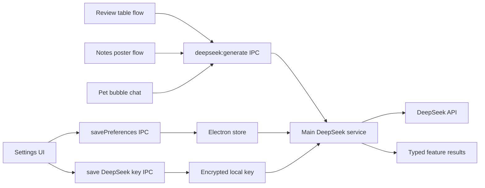

# DeepSeek Review, Notes, and Pet Chat Design

- Date: 2026-06-20
- Status: Design approved by user
- Scope: Add DeepSeek API settings, AI comment drafting for the review table action, one-image note summaries, and direct 小咪 chat inside the desktop pet prompt bubble.

## 1. Background

Bilimi already has four related surfaces:

1. Assistant settings persist local preferences through the Electron main process.
2. The review page can open `CommentChooser` and publish a selected comment draft.
3. The notes page can generate structured video notes with summaries, timelines, highlights, annotations, and archive versions.
4. The desktop pet shows a top prompt bubble and 小咪 state feedback.

The new work should connect these surfaces through one DeepSeek-backed AI service. The user selected the full implementation route: a main-process DeepSeek service with thin feature-specific renderer entrances. The user also selected direct pet chat in the existing top 小咪 prompt bubble, review table comment generation with a user-supplied intent prompt, and one-image note summaries as a card-poster layout.

## 2. Goals

1. Settings expose DeepSeek API configuration and a test action.
2. DeepSeek credentials stay in the main process and are not passed into renderer components or page scripts.
3. The review table action asks the user for a short comment intent, generates three candidate comments, and lets the user choose one to publish.
4. The notes page can generate a card-poster one-image summary from the current note.
5. The desktop pet top prompt bubble can expand into a short 小咪 chat input and recent-message view.
6. All three AI features share one request boundary and one configuration model.
7. When DeepSeek is not configured or a request fails, the UI gives a clear recoverable state instead of silently falling back to fabricated AI output.

## 3. Non-Goals

1. Do not expose the DeepSeek API key to the renderer.
2. Do not build a full long-form chat app in the desktop pet window.
3. Do not replace existing local deterministic note generation.
4. Do not auto-post AI comments without explicit user selection.
5. Do not add cloud sync, account management, or multi-provider routing in this pass.
6. Do not depend on screenshots or OCR for one-image summaries; generate the poster from the existing `VideoNote` data.

## 4. DeepSeek Configuration

Add AI provider fields to assistant preferences:

- `deepseekEnabled: boolean`
- `deepseekApiKeyStored: boolean`
- `deepseekModel: string`
- `deepseekBaseUrl: string`

The settings page shows:

1. An enable switch.
2. A password input for replacing the API key.
3. A model select or text input. Default to `deepseek-v4-flash`, with `deepseek-v4-pro` available as an advanced option.
4. A base URL input defaulting to `https://api.deepseek.com`.
5. A test-connection action that calls the main process and reports success or failure.

The main process stores the API key separately from normal preferences. Prefer Electron `safeStorage` when available and store an encrypted string in `electron-store`. If encryption is unavailable, save the key only through a deliberately named local-development fallback path. Renderer APIs only receive `deepseekApiKeyStored: true | false`.

## 5. AI Service Boundary

Create a main-process service with three high-level request types:

- `review-comment`
- `note-poster`
- `pet-chat`

The renderer sends structured context, never the key. The main process loads settings, validates that DeepSeek is enabled and configured, calls the OpenAI-compatible chat completion endpoint, and returns a parsed result.

The service should:

1. Reject requests when DeepSeek is disabled or missing a key.
2. Use a timeout.
3. Return typed error codes for missing configuration, network failure, API failure, and invalid model output.
4. Parse JSON output for review comments and poster content where possible.
5. Strip overlong outputs to UI-safe lengths.

## 6. Review Table Comment Flow

The existing review table action should become a two-step flow when DeepSeek is configured:

1. User clicks the table action.
2. Bilimi opens an intent dialog asking what kind of comment to write.
3. The user enters a short intent, such as praising technical details, light teasing, or asking for updates.
4. The renderer sends video title, author, description, tags, local classification, and the user intent to the DeepSeek service.
5. The service returns three candidate comments.
6. `CommentChooser` shows the three candidates.
7. The user selects one and Bilimi runs the existing comment automation with that selected draft.

If DeepSeek is disabled or fails, keep a recoverable UI path:

- Show the error in the chooser or dialog.
- Let the user retry or cancel.
- Do not publish anything until the user explicitly picks a draft.

## 7. One-Image Note Summary

The user selected layout A: card poster.

Add a one-image-summary action to the notes result area. When a current note exists:

1. The renderer sends the note title, author, URL, short summary, keywords, timeline highlights, and annotations to the DeepSeek service.
2. The service returns poster text fields:
   - title
   - subtitle or one-sentence takeaway
   - three to five key points
   - keywords
   - one revisit prompt or open question
3. The renderer displays a poster preview card using normal HTML/CSS.
4. The user can save the poster as an image.

For the first implementation, use browser-side rendering of a DOM poster to a canvas or SVG-backed image if available in the existing stack. If image export becomes too brittle, ship a copyable poster preview first and keep image export behind a clear disabled or error state rather than pretending it worked.

## 8. Desktop Pet Chat

The chat surface lives in the existing top 小咪 prompt bubble shown in the user's screenshot. Default state remains a compact prompt:

- Title: 小咪 prompt.
- Body: current status or assistant hint.

On click or focus:

1. The top bubble expands within the desktop pet window.
2. It shows the last few short messages.
3. It shows one input and a send button.
4. Sending calls the DeepSeek `pet-chat` request with the recent conversation and current app or video context if available.
5. 小咪 replies in a short persona voice.

Constraints:

1. Keep the bubble bounded so it does not cover most of the screen.
2. Store only a short in-memory conversation history for the first version.
3. Keep drag and resize behavior intact.
4. Do not put the API key or raw provider errors in the pet UI.
5. If DeepSeek is not configured, show a compact message directing the user to settings.

## 9. Data Flow

## 10. Testing Strategy

1. Shared type tests cover AI preference normalization without exposing the API key.
2. Main-process store tests cover saving and loading DeepSeek non-secret settings and encrypted key presence.
3. DeepSeek service tests use an injected fetch function and verify request payloads, parsing, timeout/error mapping, and no-key behavior.
4. Settings tests cover rendering DeepSeek controls, saving model/base URL, replacing the key, and test-connection feedback.
5. Review tests cover the intent dialog, AI candidate loading state, chooser rendering, retry/cancel, and selected candidate passing into the existing comment automation.
6. Notes tests cover the one-image action visibility, poster generation from an existing note, preview rendering, and save/export UI state.
7. Pet tests cover expanding the top bubble into chat, sending a message, rendering a reply, disabled configuration state, and preserving restore/drag behavior.

## 11. Acceptance Criteria

1. User can configure DeepSeek from settings without exposing the key in renderer state.
2. A successful test connection confirms the configured model and base URL.
3. The review table action asks for a user comment intent, generates three choices, and only publishes after the user selects one.
4. Notes can generate and preview an A-style card poster from the current note.
5. The poster preview has a working save/export path or a clearly disabled fallback with a tested error message.
6. The desktop pet top bubble supports direct short chat with 小咪 at the location shown in the user's screenshot.
7. Missing DeepSeek configuration is handled consistently across review, notes, and pet chat.
8. Focused tests, full test suite, and build pass before the implementation is committed.
9. After implementation is complete, all feature changes are committed together in one git commit as requested by `AGENTS.md`.
