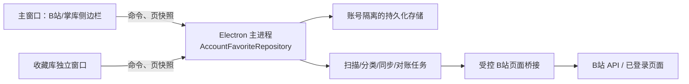
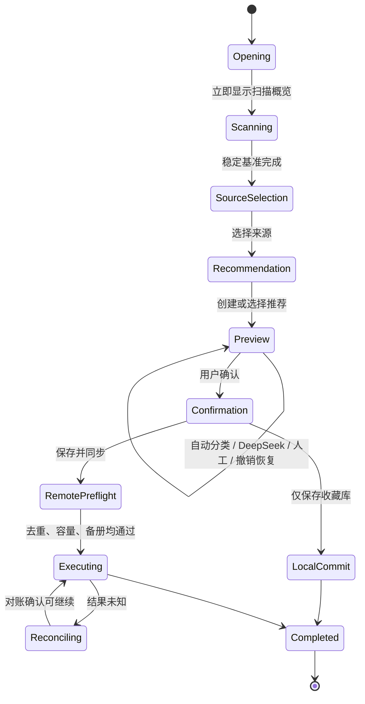

# 整理旧藏核心重做与收藏仓库底座设计

**状态：已确认，可进入实施计划**

## 目标与优先级

本项目重做“整理旧藏”的核心状态模型，并同时建立按账号隔离的收藏仓库。最高优先级是用户在不断电、不退出、不换账号的情况下，稳定完成一轮“点击整理旧藏 -> 扫描 -> 选择来源和推荐 -> 自动分类 -> DeepSeek/人工调整 -> 多步撤销恢复 -> 确认执行 -> 完成”。

“保存并同步到 B 站”是主路径，必须优先完成和验收。仅保存到收藏库是附加方案：用户可主动选择；当登录、风控或 B 站容量阻止同步时，本地成果仍可保留。收藏库是同一底座上的完整能力，但不能改变已经稳定的整理旧藏侧边栏向导，也不能阻塞同步闭环的稳定性。

## 已确认产品边界

- 基线固定为 `main@1bd67522`、版本 `1.0.5`；不以旧工作目录的分支作为依据。
- 整理旧藏继续位于当前掌库侧边栏，保留现有向导信息架构和视觉密度；新核心只替换状态、恢复与执行链路。
- 收藏库使用独立、可最大化的 Electron 工作窗口。主窗口继续负责 B 站浏览、批阅、札记、转写和现有整理旧藏 UI。
- 收藏库窗口是完整三栏桌面库：左侧导航，中部虚拟化列表，右侧可收起详情；它与整理工作区共享同一账号仓库，不共享 React 本地真相。
- 新核心不迁移旧工作区的进行中或历史批次。首次使用新核心时重新扫描并建立完整稳定镜像；旧数据不出现在正式 UI。
- 新核心完整验收后立即删除旧核心的可运行入口与开发诊断开关。Git 中的 `main@1bd67522` 和固定测试样例是唯一追溯基线。

## 统一架构

`AccountFavoriteRepository` 是唯一权威：Electron 主进程独占读写；React 仅订阅有版本号的分页/分段快照，并发送具备幂等键的命令。不得在渲染器保存另一份工作镜像、执行计划、恢复补丁或账号级同步状态。

每个账号目录至少包含：

- 规范化视频表，键为 `aid`；视频元数据、标签和缩略图状态按需更新。
- 收藏夹表；B 站物理收藏夹、逻辑 Bilimi 收藏夹和本地收藏夹都有稳定 ID。
- 成员索引；收藏夹只保存 `aid` 索引，不复制视频完整记录。
- 同步/对账记录；每个目标、操作、请求幂等键与未知结果都有状态及原因。
- 旧藏工作镜像；稳定扫描基准、冻结批次、差量命令、历史游标和检查点分层保存。
- 待续新增区；冻结批次期间发现的新增收藏仅记录在此，当前轮结束后提示继续。

工作区数据是仓库的一种短期视图：扫描完成后建立稳定基准，之后的人工调整、DeepSeek 结果和撤销/恢复仅追加差量命令。DeepSeek 整批写入一个历史步骤；本轮结束清空工作镜像历史；已经提交 B 站的真实操作不参与撤销。

## 收藏夹与同步模型

逻辑 Bilimi 收藏夹是本地一等实体，即使没有远程 B 站收藏夹也可存在。它记录远程绑定状态：`local-only`、`bound`、`pending-reconcile`、`failed`。物理分卷按 `logicalLedgerId` 归属；每卷最多 1,000 条，UI 合并显示，内部保存分卷映射。

首次扫描默认按当前“备册”原则检查现有 Bilimi 工作夹。同步分支需要时，缺失或不完整的已启用工作夹必须先补齐；扫描概览展示所有用户收藏夹和 Bilimi 工作夹，包括数量为 0 的工作夹。已备册则只绑定现有逻辑收藏夹及物理分卷，不重复创建。

用户在确认页选择：

1. **保存并同步到 B 站**：冻结计划后执行跨分段去重、远程容量预检、必要备册、幂等执行与对账。预测超过 99 个收藏夹或默认收藏夹容量超过 50,000 时阻止执行，并引导用户转移或舍弃。
2. **仅保存到收藏库**：冻结同一计划并提交本地成员关系；不创建或修改远程 B 站收藏夹。

同步前才做远程检查；预览期间不逐条远程查重。B 站写操作始终由主进程调度到已登录的 B 站页面桥接执行，Cookie 不复制到仓库或 React。结果未知先对账，禁止盲重试。

## 整理旧藏状态机

- 新用户进入整理旧藏后立刻看见“扫描概览：扫描中”；扫描完成后逐步开放来源、推荐、预览及确认。
- 老用户默认增量：仅处理新增、上次失败、待分类及未完成内容；成功完成的分类受保护。用户明确选择“全部重新整理”才解除保护；工作镜像损坏才允许全量重建。
- 默认分段常量为 2,000，允许配置。待整理不超过 2,000 时 UI 完全不出现批次概念；超过时仅加载和渲染一个分段，推荐收藏夹为整轮共享。
- 超过一组只确认一次：先跨组去重，随后容量预检，再自动进入真实执行；不增加第二次确认。
- 目标冲突优先级为人工 > DeepSeek > 系统高置信 > 系统低置信。人工/DeepSeek 可按照设置保留 1/2/3 个目标；纯系统低置信不得多目标，可靠目标不足进入待分类。
- 执行方案在预执行阶段冻结。执行时只做必要幂等校验、节流、检查点和对账，不可更改分类结果。

## 收藏库窗口

收藏库窗口首期交付完整能力，但开发/验收顺序始终在旧藏同步闭环之后。

- 左栏：全部、B 站原始收藏夹、Bilimi 本地收藏夹、逻辑收藏夹、待处理（未同步/待续/失败/结果未知）。
- 中栏：虚拟化紧凑视频列表；全局搜索按 aid 去重并列出全部归属；进入具体收藏夹时按实际成员显示。
- 右栏：可收起详情，展示原始 B 站归属、本地归属、同步/对账状态、失败原因以及可用操作。
- 支持单条、批量、按收藏夹同步；失败可重试，未知结果先对账；支持将收藏库多选的视频送入现有音频转写队列，不复制转写系统。
- 列表分页、缩略图懒加载、成员索引与渲染虚拟化保证 30,000 条不进入 React DOM。

## 恢复、隔离与性能

- 每个仓库快照、命令、任务租约和工作镜像都带 `accountMid`；跨账号命令必须拒绝。
- 进程退出或窗口关闭前，主进程将已确认的命令和检查点原子落盘；打开窗口时从同一账号恢复筛选、滚动、工作步骤及可继续任务。
- 恢复失败时可以丢弃损坏的工作镜像并像新用户一样重建；不能读取另一账号或混合旧核心数据。
- 工作区只批量落盘差量；通知采用版本号与受影响集合，避免进度更新让两个窗口全量重渲染。

## 验收与删除门槛

新核心删除旧核心前，至少通过：状态机、账号隔离、恢复失败重建、增量保护、2,000 分段、跨组去重、99/1,000/50,000 容量规划、多步历史、幂等执行、结果未知对账、30,000 列表虚拟化和不中断完整路径的自动测试。

若准备打包或发布 Windows 安装包，必须按 `docs/release-checklist.md` 对 dev、preview、真实安装包三种形态分别完成关键路径验收；不得以开发版通过替代安装包验证。
